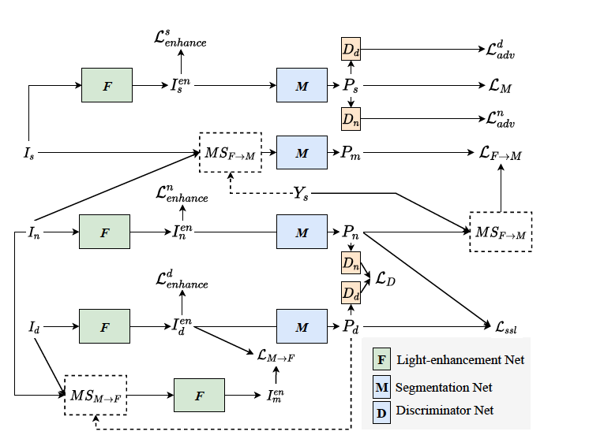
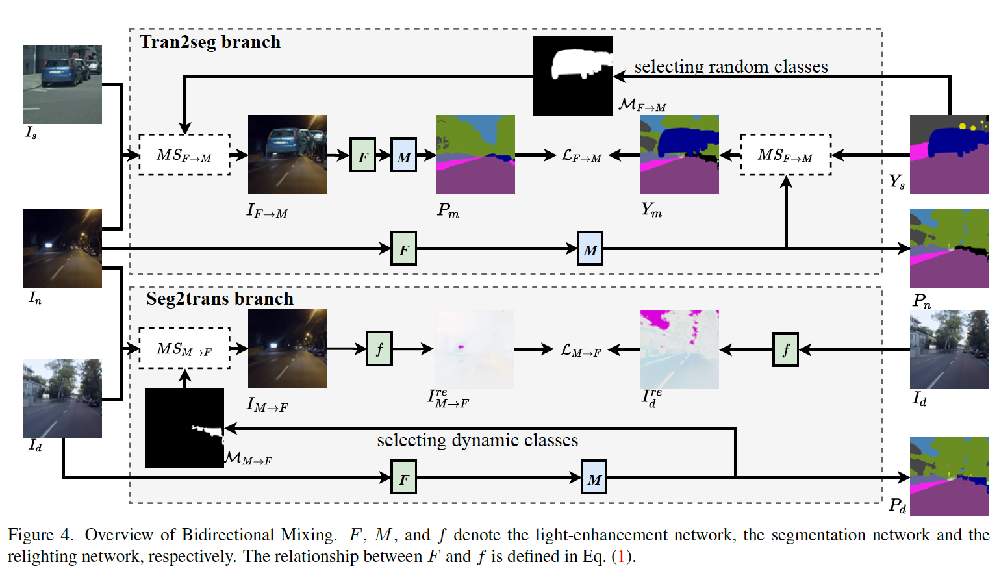

## Bi-Mix: Bidirectional Mixing for Domain Adaptive Nighttime Semnatic Segmentation

#### Research Question
How to utilize the information in coarsely aligned day-night image pairs and to benefit both translation model and segmentation model bidirectionally?

#### Motivation
1. Inspired by work DANNet, there are some issues are not considered. 1) The information in coarsely aligned image pairs are not utilized during image translation, 2) the translation model benefits the segementation model significantly, how the segementation model provide little guidance to translation module, 3) the imbalance issue in nighttime images is ignored. Above three issues affect the performance and efficiency of the nighttime segmentation task.

#### Methodology
- **Overall Goal**

  **Source domain:** daytime images
  
  **Target domain:** coarsely aligned day-night image pairs 
  
  **Goal:** learn a discriminative nighttime model whcih can benefits both image translation and segmentation adaptation process

- **Framework**

  The overall framework consists of an image-translation module and semantic segmentation module. This is a one-step domain adaptation method.
  
  
  
- **HighLight**

  Two directions: Trans2Seg and Seg2Trans, both module all use sample mixing technique
  
  Trans2Seg: relight and then predict.
  
  Seg2Trans: exploit information in image pairs to improve image translation module.
  
  

#### Experiment

- **Datasets:** 

  CityScapes, Dark Zurich and Nighttime Driving

- **Metrics:** 

  mIoU
  
- **Evaluation**

  DANNet as baseline to test on Dark Zurich-val, Dark Zurich-test and Night Driving-test
  
  1. use mixed sampling just in one direction
  2. consistency regularisation
  3. one direction mixed sampling w/o relighting module

#### Inspiration
The experiment results show that the generalization performance is not good, it may because we only use the information in coarsely aligned image pairs to improve the translation module.
