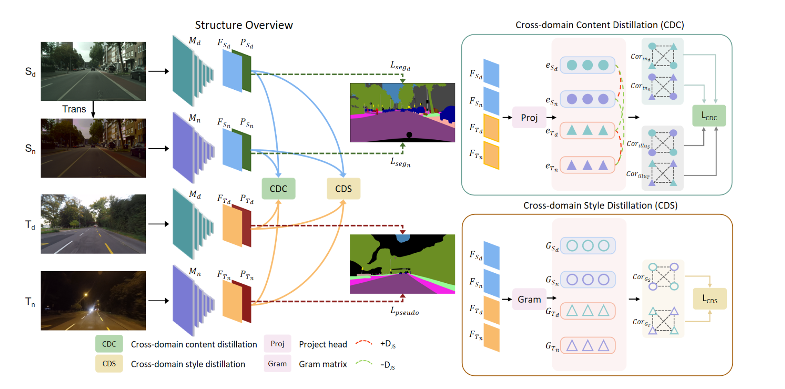

## Cross-Domain Correlation Distillation for Unsupervised Domain Adaptation in Nighttime Semantic Segmentation

#### Research Question

How to reduce the gap of illumination, content and style between daytime and nighttime images by knowledge distillation method?

#### Motivation
1. Existing methods have the issue of ignoring the inherent difference between the daytime and nighttime images, which consider both of them contain the same style. However, the appearance discrenpancy has a significant impact on the effect of adaptation.
2. Inspired by knowledge distillation, if the synthetic nighttime images in source domain is created by the content from daytime images of source domain and illumination style from nighttime images of target domain. Based on this, it ensures that the degree of difference between daytime and nighttime images in source domian is consistent with that in target domain. Then the domian shift between daytime and nighttime images in both source and targe domain can be used as the knowldge to be distilled from multi-source domain to multi-target domain.

#### methodology

- **Overall Goal**

  **Source domain:** CityScapes (daytime), Synthetic nighttime CityScapes

  **Target domain:** Dark Zurich (daytime), Dark Zurich (nighttime)

  **Goal:** To find an invariant domain shift representation as the knowledge to distill in different domians, and guide the accurate feature extraction in nigthtime images in target domain and then get the accurate predictions.

- **Framework**

  The overall framework consists of four major components: **Semantic Segmentation Network, Project Head, Cross-domain content distillation and Cross-domain style distillation**

- **HightLight**

  **Project Head:** this module is utilized to extract the content embedings for distillation, but it only exists in training stage so that it will not affect the inference time when testing.

  **CDC:** cosine similarity is utilized to calculate the degree of the content difference
  
  **CDS:** gram matrix is utilized to calculate the degree of the style difference

