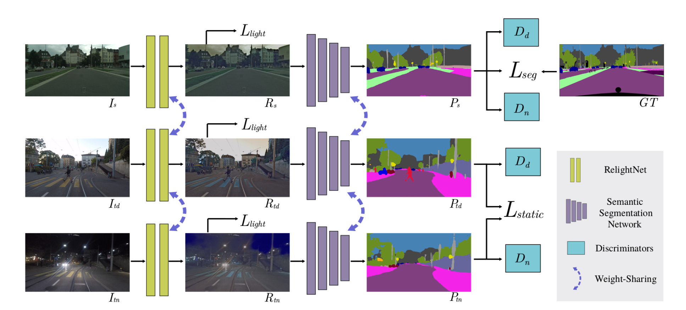

## DANNet: A One-Stage Domain Adaptation Network for Unsupervised Nighttime Semantic Segmentation

#### Research Question
How to semantic segment unlabeled nighttime images with coarsely aligned day-night image pairs using one-stage domain adaptation method?

#### Motivation
1. High-quality pixel-annotation of nighttime images is the prerequisite for training neural networks for nighttime images semantic segmentation but the label is difficult to acquire. 
2. Existing methods which aim for transferring semantic segmentation model from daytime to nighttime images require additional pre-processing stage of traning an image transfer model which is not only time-consuming but also cause the second stage closely rely on the first stage.

#### Methodology
- **Overall Goal**

  **Source domain**: Cityscapes data 
  
  **Target domain**: Dark Zurich daytime and nighttime data (coarsely aligned pairs)
  
  **Goal**: train networks on source domain, and produce predictions on target domian of daytime image as the supervision to segment its counterpart nighttime images.
  
  *TN: Here the pseudo supervision for nigthtime images from the predictions on daytime images just consider only static object categories, however, there are inevitably moving objects in same scene. If not considering the moving objects, there should be content gap.*

- **Framework**

  The overall framework consists of three modulels: **an image relighting network, a semantic segmentation network, two discriminators**
  
  
- **HighLight**
  1. relighting network
  
     The purpose of relighting three images from different domains is to reduce the distribution difference among each other.
     
     *TN: From the illumination perspective, the main gap is because the images taken in different time. To reduce the gap, I think only the nighttime images should be relighted ranther than all the images. If relighting the images taken in daytime, I think the illumination gap between images in daytime and nighttime could not be narrowed to minimal.*
     
   2. semantic segmentation network
   
      Backbone：Deeplab-v2, RefineNet, PSPNet

   3. Discriminators

      The discriminators are used to distinguish the predictions are from source domain or either of target domains.
  

#### Acceptance Reason
1. It is the first work to use one-stage domain adaptation method to perform nighttime semnatic segmentation.
2. The paper is organized in a logical way which can be understood easily by readers.

#### Experiments
- **Datasets:**

  Cityscapes, Dark Zurich and Nighttime driving
  
- **Metrics**

  mIoU
  
- **Evaluation**

  baseline: AdaptSegNet on Dark Zurich-N with full DANNet model

  1. coarsely aligned image pairs and pseudo-labels
  2. relighting and light loss
  3. $L_{static}$ compare with cross entropy
  4. reweighting strategy

#### Inspiration
1. Coarsely aligned image pairs can be further explored to utilize in nighttime semnatic segmentation task.
