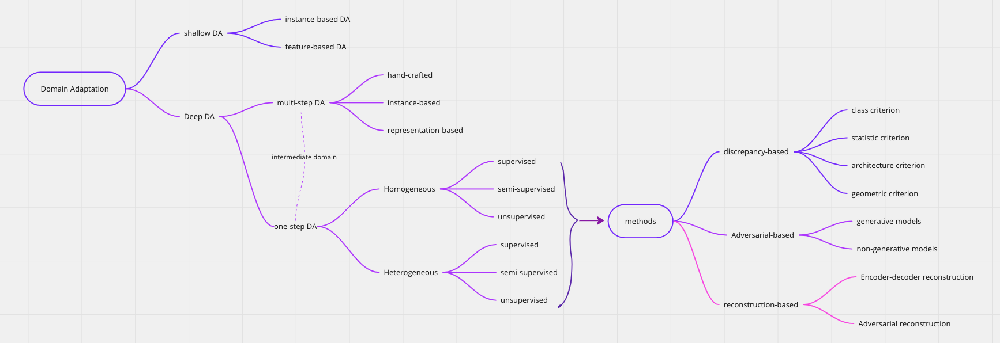

## Framework of DA

Based on paper: **Deep visual domain adaptation: A survey**

## PaperList 
### [30th Nov -2nd Dec]
1. DANNet: A One-Stage Domain Adaptation Network for Unsupervised Nighttime Semantic Segmentation [[ResearchNote]](https://github.com/chenyucheng0221/Nighttime-UDA/blob/main/ResearchNote/DANNet.md)
2. Cross-Domain Correlation Distillation for Unsupervised Domain Adaptation in Nighttime Semantic Segmentation [[ResearchNote]](https://github.com/chenyucheng0221/Nighttime-UDA/blob/main/ResearchNote/CCDistill.md)
3. Refign: Align and Refine for Adaptation of Semnatic Segmentation to Aderse Conditions [[ResearchNote]](https://github.com/chenyucheng0221/Nighttime-UDA/blob/main/ResearchNote/Refign.md)
4. Guided Curriculum Model Adaptation and Uncertainty-Aware Evaluation for Semantic Nighttime Image Segmentation [[ResearchNote]](https://github.com/chenyucheng0221/Nighttime-UDA/blob/main/ResearchNote/GCMA.md)
5. Bi-Mix:Bidirectional Mixing for Domain Adaptive Nighttime Semantic Segmentation [[ResearchNote]]()
6. Translation, Scale and Rotation: Cross-Modal Alignment Meets RGB-Infrared Vehicle Detection [[ResearchNote]]()
