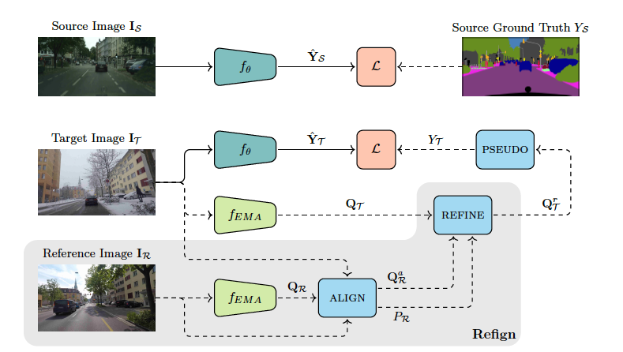

## Refign: Align and Refine for Adaptation of Semantic Segmentation to Adverse Conditions

#### Research Question
How to leverage intermediate domain as a reference to improve the predictions of the target domain images?

#### Motivation
1. There a large body of reseach keen on the unsupervised domain adaptation to adapte the labeled source domain to different unlabeled target domain. Our work is the extension of UDA methods to enhance the performance of current approaches.
2. There is an issue of noisy propagation in previous UDA methods, which results in a drift in pseudo-labels. The issue could lead an overfitting problem in large neural networks so that the generalization performance would be degraded. This is issue would be tackled in this work.

#### Methodology

- **Overall Goal**
  **Source domain:** CityScapes
  
  **Intermediate domain (Reference):** normal-condition images of ACDC (share the content and region characteristic with target domain, share the weather and time with source domain)
  
  **Target domain:** adverse-condition images of ACDC
  
  **Goal:** Leverage normal-condition images overlapped with source and target domain as reference to imporove the predictions of target domain images.

- **Framework**

  The framework consists of two modules: the alignment module and the refinement module
  
  

- **HighLight**

  **Alignment Module:**
  
  Spatial alignment of the target image and intermediate image is the preliminary condition for the latter refinement. Here introducing a warp component to achieve it.
  
  **Refinement Module:**
