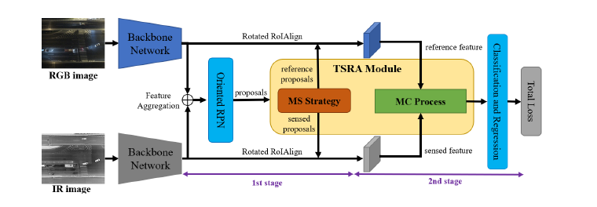

## Translation, Scale and Rotation: Cross-Modal Alignment Meets RGB-Infrared Vehicle Detection

#### Research Question
How to address the cross-modal weakly misalignment in aerial RGB-IR images?

#### Motivation
1. Misalignment is a common issue in cross-moal image application, if it is not addressed, the methods based on such images could suffer from performance degradation.
2. In aerial images, they differ not only in position, but also in scale and angle due to the hardware error and annotation error, moreover, such misalignment are coupled so that changing on will affect another one.

#### Methodology

- **Overall Goal**

  **Input:** RGB image and IR image
  
  **Goal:**

- **Framework**

- **HighLight**

  **TSRA module:** alignment process + modality-selection strateget + multi-task jitter
  
  modality-selection strategy is to select the bounding box with better annoation in the two modalities as the reference modality, which can avoid the deviation if just choose the annotation from one fixed modality. Multi-task jitter can augument the alignment process.

#### Experiments

- **Datasets:** 

  DroneVhicle

- **Metric:**

  mAP

- **Evaluation**

  1. with/without modality-selection strategy and multi-task jitter

#### Inspiration
